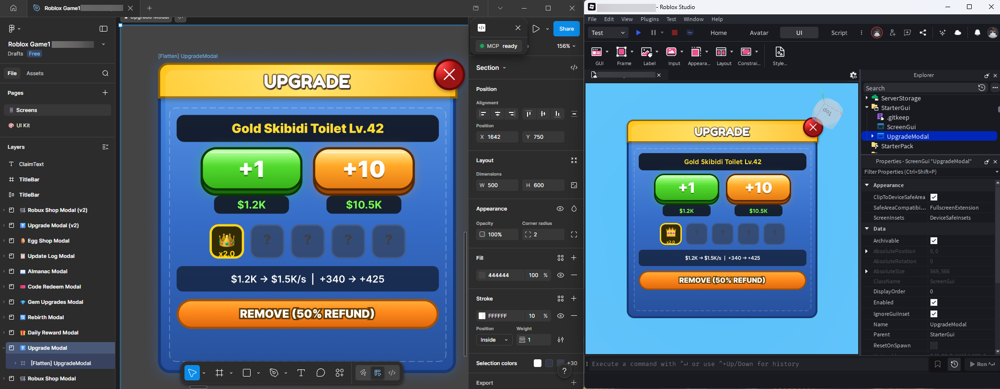

# 🔨 FigmaForge

**Pixel-accurate Figma → Roblox UI exporter using the PNG-slice pipeline.**

Extracts any Figma frame and generates a production-ready `.rbxmx` file: every visual element becomes a PNG `ImageLabel`, dynamic text becomes `TextLabel`, and layout hierarchy is preserved as nested `Frame` containers. Drop shadows, gradients, strokes, and effects are all baked into the PNGs — zero approximation, pixel-perfect results.

## ✨ How It Works



**Every Layer Sliced** — FigmaForge classifies each node as one of three types:

| Classification | Roblox Instance | Logic |
|---|---|---|
| **PNG** | `ImageLabel` | Any leaf node or subtree without dynamic text → rasterized via `exportAsync` |
| **Dynamic Text** | `TextLabel` | Text nodes with `$` prefix or matching dynamic patterns (`price`, `level`, etc.) |
| **Container** | `Frame` | Parent nodes with dynamic text descendants → preserves hierarchy, self rasterized as background |

This means complex Figma features (radial gradients, blurs, complex strokes, shadows) all "just work" because they're baked into the PNG — no need for Roblox approximations.

## 🏗️ Architecture

```
Figma Desktop (MCP Bridge plugin)
        ↓  figma_execute → extraction script runs in Figma sandbox
  JSON Manifest (IR with node tree + base64 PNGs)
        ↓  figma-forge-cli.ts --resolve-images
  Pipeline: classify → upload PNGs → assemble .rbxmx
        ↓
  .rbxmx file  ──→  Rojo auto-sync  ──→  Roblox Studio
                     (file watcher)        (StarterGui)
```

### Module Map

| Module | Purpose |
|---|---|
| `figma-forge-ir.ts` | TypeScript IR interfaces — node tree, fills, strokes, text, effects, `_renderBounds` |
| `figma-forge-extract.ts` | Builds the JS extraction script for Figma sandbox — node serialization, render bounds capture, layer classification |
| `figma-forge-assemble.ts` | `.rbxmx` XML generator — node classification, positioning, ImageLabel/TextLabel/Frame emission |
| `figma-forge-images.ts` | Image upload pipeline — base64 PNG → Roblox Open Cloud API → `rbxassetid://` |
| `figma-forge-shared.ts` | Font mapping (Figma→Roblox), layout utilities, text classification patterns |
| `figma-forge-cli.ts` | CLI orchestrator — ties extraction manifest into assembly pipeline |
| `figma-forge-export.ts` | Export helpers |
| `figma-forge-animations.ts` | Prototype transition → TweenService animation specs |

## 🚀 Quick Start

### Prerequisites

- [Node.js](https://nodejs.org/) 18+
- [Figma Desktop](https://www.figma.com/downloads/) with the MCP Desktop Bridge plugin running
- [Rojo](https://rojo.space/) serving your project (for `.rbxmx` auto-sync)
- Roblox Open Cloud API key in `scripts/roblox-config.json`

### Build

```bash
cd tools/FigmaForge
npm install
npx tsc --outDir dist
```

### Usage

```bash
# Generate .rbxmx with image uploads (pass credentials directly)
npx ts-node figma-forge-cli.ts \
  --input manifest.json \
  --output ../../src/StarterGui/MyFrame.rbxmx \
  --resolve-images \
  --api-key YOUR_ROBLOX_API_KEY \
  --creator-id YOUR_ROBLOX_CREATOR_ID \
  --verbose
```

### CLI Options

```
Options:
  --input, -i        Path to FigmaForge manifest JSON
  --output, -o       Path for generated .rbxmx file
  --config, -c       Path to custom figmaforge.config.json
  --text-export      Text export mode: 'all' (default), 'dynamic', 'none'
  --resolve-images   Upload rasterized PNGs to Roblox (requires API key)
  --api-key          Roblox Open Cloud API key (highest priority)
  --creator-id       Roblox creator/user ID for asset ownership
  --verbose, -v      Show detailed processing info
  --help, -h         Show help
```

## 📸 Image Pipeline

When extraction identifies PNG nodes, they're rasterized via `exportAsync` at 2× scale. The CLI uploads them to Roblox Cloud and patches `rbxassetid://` URIs into the `.rbxmx`.

### Configuration

Config priority for Roblox API credentials:

1. **CLI arguments** (recommended) — `--api-key YOUR_KEY --creator-id YOUR_ID`
2. **Environment variables:** `ROBLOX_API_KEY` + `ROBLOX_CREATOR_ID`
3. **`.env` file** in FigmaForge directory
4. **`scripts/roblox-config.json`** — project-level fallback

> [!WARNING]
> **Always clear stale env vars** before running CLI: `$Env:ROBLOX_API_KEY=$null; $Env:ROBLOX_CREATOR_ID=$null`

### Custom Configuration (`figmaforge.config.json`)

FigmaForge is genre-agnostic. You can override the default text and button detection heuristics by providing a `figmaforge.config.json` file in your working directory, or pointing to one with `--config`.

```json
{
  "dynamicPrefix": "$",
  "textExportMode": "all",
  "dynamicNamePatterns": [
    "^price", "^level", "^score", "^amount"
  ],
  "dynamicTextPatterns": [
    "^\\\\{[^}]+\\\\}$",
    "^[\\\\d,]+$"
  ],
  "interactivePatterns": [
    "btn", "button", "tab_"
  ]
}
```

- **`textExportMode`**: Controls how text is emitted.
  - `"all"` (default): Every text node becomes a Roblox `TextLabel`.
  - `"dynamic"`: Only text nodes matching the dynamic patterns become `TextLabel`s. All other text is baked into the rasterized PNG background.
  - `"none"`: All text is baked into the background PNG.

### Caching

Uploaded images are cached by content hash in `.figmaforge-image-cache.json`. Re-exports reuse existing `rbxassetid://` URIs. Delete the cache file to force re-uploads.

## 🎯 Render Bounds (Drop Shadow Fix)

> [!IMPORTANT]
> This is a critical architectural detail for pixel-perfect exports.

Figma's `exportAsync()` renders at `absoluteRenderBounds` (includes effects like drop shadows, blurs), but the node's `.width/.height` properties only report the logical bounding box. Without correction, PNGs with shadow padding get squeezed into too-small ImageLabels.

**FigmaForge handles this automatically:**

1. **Extraction** (`figma-forge-extract.ts`): Compares `absoluteRenderBounds` vs `absoluteBoundingBox` for nodes with visible `DROP_SHADOW`, `INNER_SHADOW`, or `LAYER_BLUR` effects. Stores the delta as `_renderBounds` in the IR.
2. **Assembly** (`figma-forge-assemble.ts`): Uses `_renderBounds` for ImageLabel position and size when present, falling back to standard `x/y/width/height` otherwise.

**Example impact:**

| Node | Node Bounds | Render Bounds | Shadow Padding |
|---|---|---|---|
| UpgradeBtn (drop shadow r:16 s:2) | 130×59 | 172×101 | +21px/side |
| TitleBar (drop shadow r:4 s:2) | 400×48 | 412×60 | +6px/side |

## 🧠 Node Classification

The assembler (`figma-forge-assemble.ts` → `classifyNode`) determines how each IR node is emitted:

| Criterion | Classification | Output |
|---|---|---|
| Text matching config rules / export mode | `text_dynamic` | `TextLabel` |
| Has children with dynamic text descendants | `container` | `Frame` (with background ImageLabel if hybrid) |
| Everything else (leaf, no dynamic children) | `png` | `ImageLabel` |

Dynamic text patterns are customizable via `figmaforge.config.json`. By default, they include: `$Price`, `$Level`, `$SocketIcon_N`, names matching `/^(price|level|score|timer|count|amount|value|quantity|health|progress|rank|unit|socket|stats)/i`, and placeholder content like numbers-only, `x2.0`, `?`, etc.

## ⚠️ Known Limitations

- **Roblox font mapping** — Figma fonts are mapped to closest Roblox equivalent (Inter→BuilderSans). Some fonts may not have exact matches.
- **Per-corner radius** — Roblox `UICorner` only supports uniform radius. Per-corner is approximated with max value.
- **`SPACE_BETWEEN` layout** — No Roblox equivalent, falls back to `MIN` alignment.
- **Component instances** — Exported as their expanded tree, not as Roblox component references.

## 🔧 Troubleshooting

| Symptom | Cause | Fix |
|---|---|---|
| Rojo: `invalid digit found in string` | Negative value in `<token>` tag | Tokens must be unsigned ints (0+) |
| Rojo: `duplicate referent` | Two nodes share same referent ID | Check assembler assigns unique referents |
| Empty/white ImageLabels | Unresolved image hashes | Run with `--resolve-images` |
| Squished buttons/shadows | Missing render bounds | Ensure extraction captures `absoluteRenderBounds` |
| `[Flatten]` in node name | Rojo interprets brackets | Post-process: strip `[Flatten]` tags from .rbxmx |
| Rojo won't re-sync destroyed instance | `$ignoreUnknownInstances: true` | Disconnect and reconnect Rojo plugin |
| Images fail to load | Stale image cache | Delete `.figmaforge-image-cache.json` and re-run |

## 📄 License

MIT License — see [LICENSE](LICENSE) for details.
